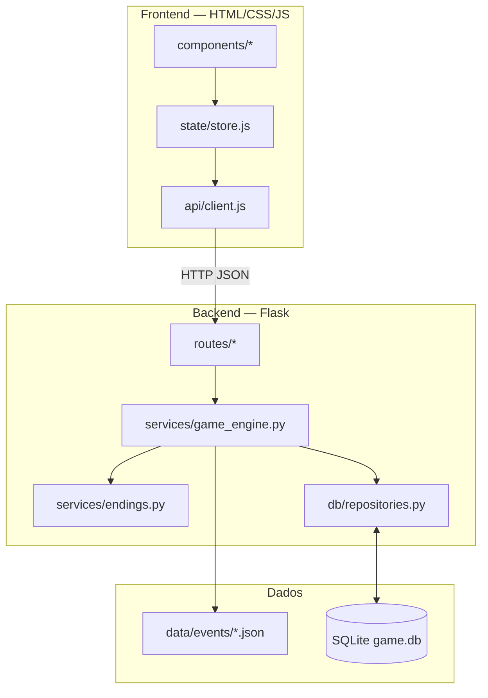
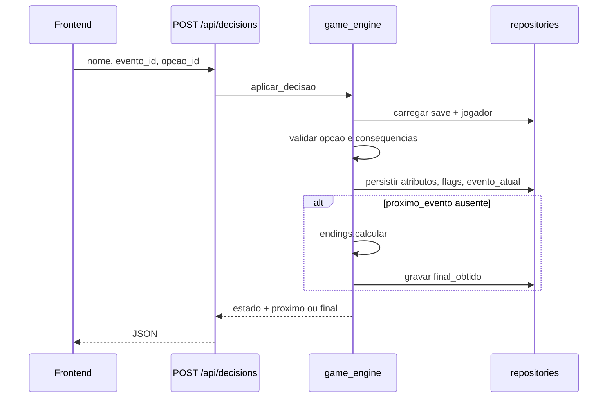

# Arquitetura

O sistema segue **três camadas** com dependência **unidirecional**: o frontend só conversa com HTTP; rotas só validam e delegam; serviços contêm regra de jogo e leitura de roteiro; repositórios isolam SQLite.

## Diagrama (camadas)

## Regras de dependência

| Origem | Destino permitido |
|--------|-------------------|
| `frontend/` | Apenas API HTTP via `api/client.js` |
| `backend/app/routes/` | Serviços + repositórios (sem SQL direto) |
| `backend/app/services/` | Repositórios, JSON de eventos, `endings.json` — sem DOM |
| `backend/app/db/repositories.py` | SQLite, schema conhecido |

- **Roteiro** não vive em código Python/JavaScript de produção — apenas em `backend/data/events/*.json`.

## Fluxo de uma decisão

## Pastas principais

- `frontend/` — SPA leve por módulos ES (cliente da API).
- `backend/app/` — factory Flask, blueprints, serviços, DB.
- `backend/data/events/` — índice e capítulos JSON.
- `docs/` — contratos e guias (este arquivo, API, formato de evento, etc.).
