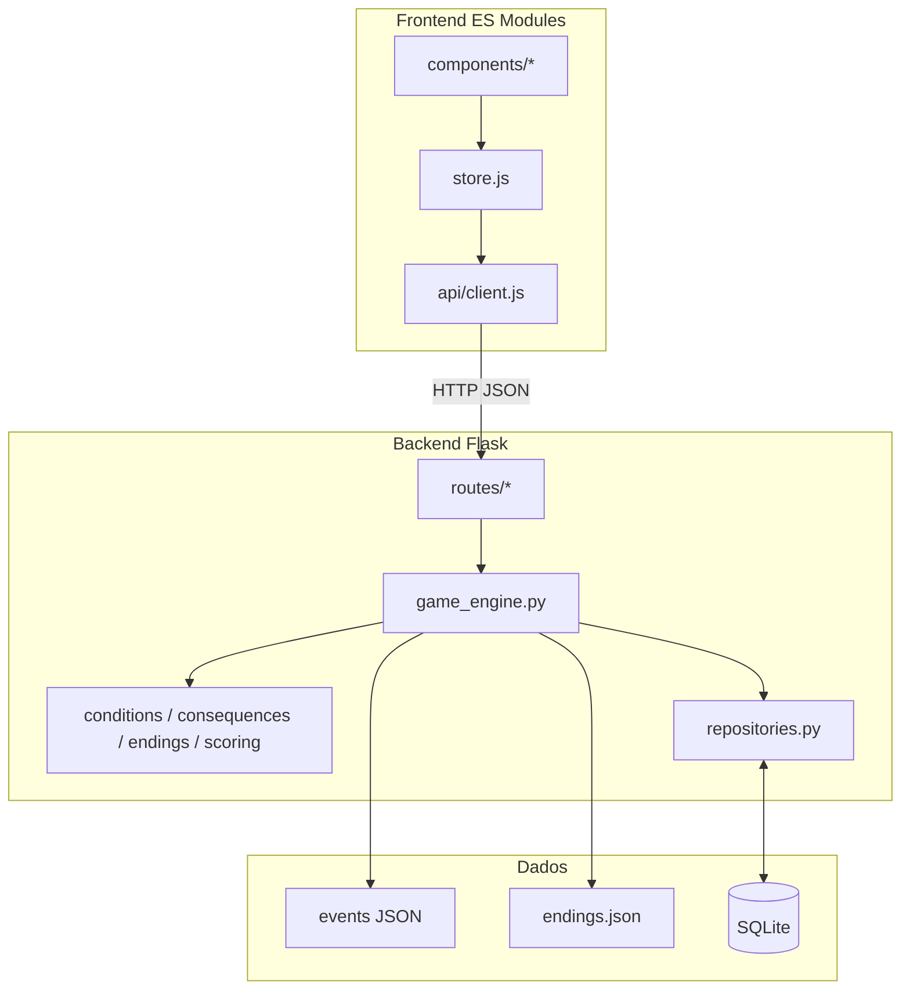
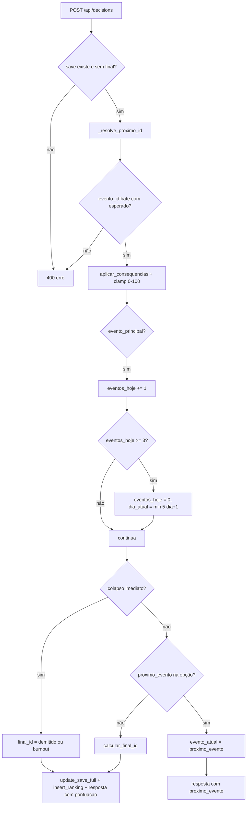

# Referência técnica — Corporate Survivor

Documento único com **arquitetura**, **regras de negócio**, **banco**, **API**, **parâmetros numéricos** e **formato de dados** do projeto. Segue o desenho **data-driven**: roteiro em JSON no backend, engine aplica regras; o frontend só exibe estado e envia decisões.

---

## 1. Visão geral e princípios

- **Narrativa em JSON**: eventos em `backend/data/events/*.json` e índice em `index.json`. Nenhum roteiro embutido em Python ou na UI.
- **Engine sem HTML/DOM**: serviços retornam estruturas serializáveis (dicts/listas).
- **UI sem regra de jogo**: o cliente HTTP não calcula finais nem condições; apenas apresenta o que a API devolve e envia escolhas.
- **SQL centralizado**: consultas em `backend/app/db/repositories.py` e DDL em `schema.sql`.

### Diagrama de camadas



---

## 2. Stack e configuração

| Item | Detalhe |
|------|---------|
| **Runtime** | Python 3.10+ |
| **Web** | Flask, Flask-CORS |
| **Persistência** | SQLite via `sqlite3` (stdlib) |
| **Frontend** | HTML/CSS/JS (ES modules), sem build |

**`create_app()`** (`backend/app/__init__.py`):

- `DATABASE_PATH` via variável de ambiente; padrão `backend/game.db` (relativo à raiz do projeto onde o Flask roda).
- CORS habilitado para `/api/*` em desenvolvimento.
- Pasta `frontend/` servida como estático na raiz `/`.

**Execução** (`backend/run.py`): `host=0.0.0.0`, `port=5000`, `debug=True`.

---

## 3. Banco de dados (schema e migrações)

Schema DDL: `backend/app/db/schema.sql`.

### Tabelas

| Tabela | Colunas-chave | Observações |
|--------|---------------|-------------|
| `players` | `id`, `nome` UNIQUE, `criado_em` | Nome do jogador é chave de negócio na API |
| `saves` | `player_id` PK, `evento_atual`, 6 atributos, `dia_atual`, `eventos_hoje`, `flags_json`, `final_obtido`, `atualizado_em` | Relação 1:1 com `players` |
| `decisions` | `id`, `player_id`, `evento_id`, `opcao_id`, `decidido_em` | Histórico append-only |
| `ranking_global` | `id`, `player_id`, `nome`, `pontuacao`, `final_id`, `registrado_em` | Linha inserida ao encerrar partida com final |

### Valores iniciais do save (`insert_default_save`)

| Campo | Valor | Justificativa |
|-------|-------|---------------|
| `energia` | 70 | Trainee disposto, não no teto |
| `reputacao` | 50 | Neutro |
| `networking` | 50 | Neutro |
| `ansiedade` | 0 | Começa calmo |
| `produtividade` | 50 | Neutro |
| `aprendizado` | 50 | Neutro |
| `dia_atual` | 1 | Início da semana |
| `eventos_hoje` | 0 | Nenhum evento principal contado ainda |

### Migrações (`backend/app/db/migrations.py`)

- **`apply_saves_corporate_survivor_attrs`**: compatibilidade com schema legado (`estresse` → `ansiedade`, `conhecimento_tecnico` → `aprendizado`). Sem Alembic.
- **`ensure_progresso_e_ranking`**: adiciona `dia_atual` / `eventos_hoje` com `ALTER TABLE` se ausentes; cria `ranking_global` se não existir.

**Momento de execução**: na subida da aplicação, em `backend/app/db/connection.py` (`init_app`), após `executescript(schema.sql)`.

---

## 4. API REST

Blueprints registrados em `backend/app/__init__.py`.

### Rotas principais

| Blueprint | Prefixo | Métodos | Função central |
|-----------|---------|---------|----------------|
| `players` | `/api/players` | POST, GET | `ensure_player_with_save` |
| `saves` | `/api/saves/<nome>` | GET, PUT, DELETE | `update_save_full`, `reset_save` |
| `events` | `/api/events` | GET `/proximo`, GET `/<id>` | `proximo_evento_completo` |
| `decisions` | `/api/decisions` | POST, GET `/<nome>` | `aplicar_decisao` |
| `ranking` | `/api/ranking` | GET | `ranking_top` |

### Erros

Resposta típica: `{ "erro": "..." }` com status **400** ou **404**.

### `PUT /api/saves/<nome>`

**Whitelist** de campos atualizáveis a partir do JSON do body:

`evento_atual`, `energia`, `reputacao`, `networking`, `ansiedade`, `produtividade`, `aprendizado`, `dia_atual`, `eventos_hoje`, `flags`, `final_obtido`.

`flags` deve ser um **objeto** (dict). Valores numéricos são validados como inteiros.

---

## 5. Engine de jogo (`game_engine.py`)

### Fluxo de `aplicar_decisao`



Ao encerrar com `final_id`: `update_save_full`, `insert_decision` (histórico append-only em `decisions`), `insert_ranking_entry` e resposta com `pontuacao`, `posicao_ranking`, `ranking_top` (ver `_payload_fim_de_jogo`).

---

## 6. Elegibilidade de eventos (`_resolve_proximo_id`)

1. Se `final_obtido` está preenchido → retorna `None` (sem próximo evento de jogo).
2. Se o `evento_atual` do save ainda satisfaz **todas** as condições do evento → mantém esse id.
3. Caso contrário, percorre `ordered_event_ids()` (ordem de `index.json`) e devolve o **primeiro** evento cujas condições passam.

### Tipos de condição (`backend/app/services/conditions.py`)

| Tipo | Parâmetros | Passa quando |
|------|------------|--------------|
| `flag_ausente` | `chave` | Flag inexistente ou falsy |
| `flag_presente` | `chave` | Flag existe e é truthy |
| `atributo_min` | `chave`, `valor` | Atributo ≥ `valor` |
| `atributo_max` | `chave`, `valor` | Atributo ≤ `valor` |

Avaliação: **AND** sobre todos os itens de `condicoes`. Lista vazia `[]` → sempre elegível.

---

## 7. Consequências (`backend/app/services/consequences.py`)

| Tipo | Parâmetros | Efeito |
|------|------------|--------|
| `set_flag` | `chave`, `valor` | Atualiza mapa `flags` do save |
| `alterar_atributo` | `chave`, `delta` | Soma `delta`; **clamp 0–100** após aplicar todas as consequências da opção |

**Atributos válidos** (frozenset): `energia`, `reputacao`, `networking`, `ansiedade`, `produtividade`, `aprendizado`.

---

## 8. Progressão de dia

Campo **`evento_principal`** no JSON do evento (boolean). **Default quando omitido: `true`**.

Para cada decisão em evento com `evento_principal: true`:

```
eventos_hoje += 1
se eventos_hoje >= 3:
    eventos_hoje = 0
    dia_atual = min(5, dia_atual + 1)
```

- **3 eventos principais** por dia avançam o dia civil do jogo.
- **Dia máximo: 5** (sexta).
- Campos **`dia`** e **`momento_no_dia`** no JSON são **só metadados narrativos**; não controlam `dia_atual` / `eventos_hoje`.

---

## 9. Finais e colapso (`backend/app/services/endings.py`)

### Colapso imediato

Verificado após cada decisão e em `GET /api/events/proximo` (fluxo de “próximo estado”).

| Condição | `final_id` |
|----------|------------|
| Qualquer entre `energia`, `reputacao`, `networking`, `produtividade`, `aprendizado` **≤ 0** | `demitido` |
| `ansiedade >= 82` **e** `energia <= 45` | `burnout` |

*Somente esses cinco atributos geram demissão por limite ≤ 0; `ansiedade` em 0 não dispara demissão por “atributo zerado” nesse conjunto.*

### Finais ao terminar a cadeia (`calcular_final_id`)

Chamado quando a opção não define `proximo_evento` (fim de ramo). Ordem **exclusiva** — primeira regra que casa **ganha**:

| Prioridade | ID | Condição (resumo) |
|------------|-----|-------------------|
| 1 | `demitido` | mesmo critério de colapso: algum entre `energia`, `reputacao`, `networking`, `produtividade`, `aprendizado` ≤ 0 |
| 2 | `burnout` | `ansiedade` ≥ 82 **e** `energia` ≤ 45 |
| 3 | `risco_operacional` | `produtividade`, `reputacao` ou `aprendizado` ≤ 30 **ou** `ansiedade` ≥ 85 **ou** `energia` ≤ 20 |
| 4 | `trainee_lenda` | `produtividade`, `reputacao` e `aprendizado` ≥ 80 **e** `ansiedade` ≤ 40 **e** `energia` ≥ 45 |
| 5 | `promessa_corporativa` | média(`produtividade`, `reputacao`, `networking`, `aprendizado`) ≥ 70 **e** `ansiedade` ≤ 60 |
| 6 | `sobrevivente_onboarding` | `ansiedade` ≥ 70 |
| 7 | `funcionario_invisivel` | caso padrão |

Textos e títulos exibíveis: `backend/data/endings.json` (ids fixos esperados pelo código).

---

## 10. Pontuação (`backend/app/services/scoring.py`)

```
bruto = energia
      + 2 * reputacao
      + networking
      + 2 * produtividade
      + 2 * aprendizado
      - 3 * ansiedade
pontuacao = max(0, min(9999, bruto))
```

- Peso dobrado: reputação, produtividade, aprendizado.
- Ansiedade penaliza com peso **3**.
- Resultado final limitado ao intervalo **0–9999**.

---

## 11. Formato de evento (JSON)

Arquivos em `backend/data/events/*.json`; lista de arquivos em `index.json` (`{ "arquivos": [...] }`).

### Objeto evento

| Campo | Obrigatório | Tipo | Uso |
|-------|-------------|------|-----|
| `id` | sim | string | Id estável; usado em `saves.evento_atual` e histórico |
| `descricao` | sim | string | Texto principal na UI |
| `condicoes` | sim | array | Lista de condições (AND); `[]` = sempre elegível |
| `opcoes` | sim | array | Opções de escolha |
| `evento_principal` | não | bool | Default `true`; conta para progresso diário |
| `fundo` | não | string | Sufixo de classe CSS `scene--<fundo>` |
| `personagem` | não | string ou null | Interlocutor na UI |
| `dia` / `momento_no_dia` | não | int | Metadados narrativos |

### Objeto opção

| Campo | Obrigatório | Uso |
|-------|-------------|-----|
| `id` | sim | Enviado em `POST /api/decisions` |
| `texto` | sim | Rótulo do botão |
| `consequencias` | sim | Lista de efeitos (`set_flag`, `alterar_atributo`) |
| `proximo_evento` | não | Id do próximo evento; ausente/null → fim de ramo → `calcular_final_id` |

---

## 12. Frontend

### Estado global (`frontend/js/state/store.js`)

| Campo | Valores | Descrição |
|-------|---------|-----------|
| `phase` | `home`, `login`, `playing`, `ending`, `empty` | Tela lógica atual |
| `playerName` | string ou null | Jogador ativo |
| `save` | objeto ou null | Último snapshot da API |
| `evento` | objeto ou null | Evento em exibição |
| `final` | objeto ou null | Dados do final quando aplicável |
| `metaFim` | `{ pontuacao, posicao_ranking, ranking_top }` ou null | Metadados de fim de partida |
| `error` | string ou null | Erro amigável |
| `busy` | boolean | Bloqueio de UI durante HTTP |

### Regra de UI

Nenhum componente deve calcular finais, condições de evento ou consequências. Barras/atributos podem **clamp** só para exibição (0–100); valores autoritativos vêm sempre do save retornado pela API.

---

## 13. Roteiro ativo (referência)

- **`backend/data/events/index.json`**: `{ "arquivos": ["semana_corporate.json"] }`
- **`backend/data/events/semana_corporate.json`**: semana corporativa (15 eventos, ids `CS_D01_E1` … `CS_D05_E3`; opções com flags `ok_<id>` típicas).
- **`backend/data/endings.json`**: cópia de texto por `id` de final.

Para alterar narrativa: editar JSON + índice; evitar mudar ids de finais sem atualizar `endings.py` e conteúdo de `endings.json`.

---

## 14. Documentação relacionada

Outros arquivos em `docs/` podem detalhar formatos ou fluxos pontuais; esta referência consolida arquitetura e parâmetros numéricos em um só lugar.

**Índice sugerido de leitura**: regras de projeto em `.cursor/rules/` → este documento → `docs/API.md` / `docs/DATABASE.md` conforme necessário.
